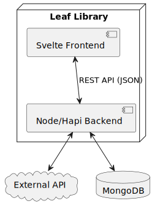

# Leaf Library - Backend

I really like houseplant and botanical gardens, therefore *Leaf Library* is my take on a digital botanical garden, and
it also serves as my project assigment for the *Advanced Fullstack* course.

## Table of Contents
- [Entities](#entities)
    - [User](#user)
    - [Plant](#plant)
    - [Collection](#collection)
- [ API ](#api)
- [Concepts](#concepts)
    - [Data Model](#data-model)
    - [System View](#system-view)
- [Run Local](#run-local)
- [Tests](#tests)

## Entities

### User
Represents a person who enjoys plants. Each `User` has the following attributes:

```ts
export interface User {
  _id: string;
  email: string;
  password: string;
  firstName: string;
  secondName: string;
  aboutMe: string | null;
  imageUrl: string | null;
}
```

### Plant
Represents interesting plants discovered by a user and stored in the *Leaf Library*.  
Each plant is saved as a `Plant` object with the following attributes:

```ts
export interface Plant {
  _id: string;
  commonName: string;
  scientificName: string;
  type: PlantType;
  biome: Biome;
  imageUrls: string[] | null;
  note: string | null;
  date: Date;
  latitude: number;
  longitude: number;
  userId: User["_id"];
}
```
#### PlantType and Biome
`PlantType` and `Biome` are simple classification categories that help users organize their plants.  
They are not intended to be botanically accurate, but rather to make it easier for users to sort and browse their collections.

- **PlantType** can be one of the following:  
  `Tree`, `Flower`, `Fern`, `Moss`, `Grass`, `Aquatic Plant`, `Climber`, `Other`

- **Biome** can be one of the following:  
  `Urban`, `Meadow`, `Forest`, `Pond`, `River`, `Sea`, `Desert`, `Other`

### Collection
Collections can be created by users to provide more ways to organize their plants.
A single plant can belong to multiple collections at the same time.
The following attributes characterize the `Collection`:
```ts
export interface Collection {
  _id: string;
  name: string;
  description: string;
  imageUrl: string | null;
  userId: User["_id"];
  plantIds: Plant["_id"][];
}
```
## API
The *Leaf Library Backend* primarily serves as an API interface for the upcoming Svelte frontend application (to be developed).  
The API is secured with JWT authentication, and an interactive API documentation is available at:

[http://localhost:3000/documentation](http://localhost:3000/documentation)

For instructions on how to build and run the project locally, see the [Run Local](#run-local) section.

## Concepts

### Data Model


### System View


## Run Local
1. Clone the repository:
   ```bash
   git clone https://github.com/johannesroesner/leaf-library-backend

2. Navigate to the directory:
   ```bash
   cd leaf-library-backend

3. Install dependencies::
   ```bash
   npm install

4. Start the application:
   ```bash
   npm run start

## Tests
To ensure safe and reliable development, the project includes a CI pipeline.  
The backend is protected by a set of unit tests and HTTP tests to verify functionality.
